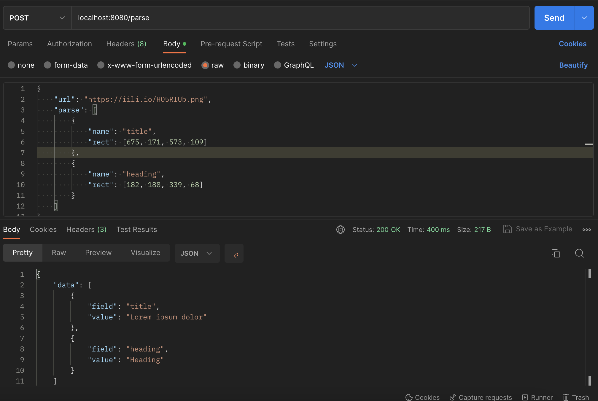

# gosseract-http

Simple ocr http server with Tesseract for parse text from Image URL.

## Quick Start
Development with Docker
```bash
$ sh build-dev.sh
```

Manual setup
```bash
$ go mod download
$ go run .

# open http://localhost:8080
```

## Test Endpoint
```bash
curl --location 'localhost:8080/parse' \
--header 'Content-Type: application/json' \
--data '{
    "url": "https://iili.io/HO5RIUb.png",
    "parse": [
        {
            "name": "title",
            "rect": [675, 171, 573, 109]
        },
        {
            "name": "body",
            "rect": [669, 294, 1010, 367]
        },
        {
            "name": "heading",
            "rect": [182, 188, 339, 68]
        }
    ]
}'
```

